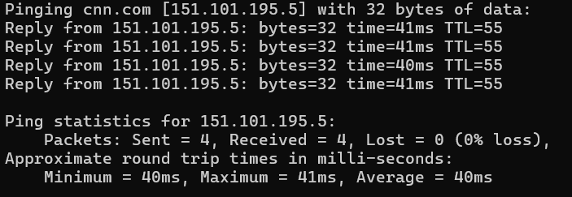

[back to Thoughts](https://github.com/Marking-Time/Thoughts/tree/main)  
1/23/2025
# Follow the Money
It was said during Watergate that the way to find the truth was to "Follow the money".  I am educated as an accountant, so I thought I would use that training and apply it to our current situation.  

## Some Cash History  
Money used to be tracked by accountants and bookkeepers. Up until the early 1970s all tansactions were paper based.  A customer would pay in cash or write a paper check which was collected by the mechant and sent to the merchants bank at the end of the day with the daily cash deposit. Merchants used journals and ledgers to record these transactions which could be reconciled with the paper tapes produced by cash registers. In the case of cash that was it, you were done.  The audit trail was simple. (cash>cash regisgter tape> mechants cash journal>mechants bank desposit slip>the bank> mechants bank account)  

If the mechant accepted a check from the customer (it was often the case that the merchant would only accept chacks from people they knew - "No out of town checks") the tansaction was longer. The first part of the transaction was the same. The difference was when the check reached the bank. The bank would determine if the check was drawn from an account at thier bank or at another bank. If the customers check was from thier bank then the process was simple. The bank deducted the amount from the customers account and added it to the merchants account.  All of this was recorded in journals and ledgers and could be audited/reconciled through the paper reciepts, deposit slips and journals/ledgers for both the merchant and the bank.  This was the beginnig of "the float". The writer of the check knew that the bank would not deduct the money from thier account until the at least the next day. On weekends it would take longer. Some customers would write checks over the weekend when they knew the money was not in thier account and knew that they would be fine as long as they made a deposit the before the bank processed the check.  This was called "floating a bad check". Audit trail was similar to cash except for some aditional bank processing.  

If the customers chack was from out of town, or from a different bank at in the same town, the process was longer. Once the check hit the bank the bank would send the check to an "Automated Clearing House"(ACH). The ACH would collect checks from banks and organize themm by the bank that the customer used. The ACH would send the physical chacks to the customers bank where the customer's account would be charged and a payment sent to the mechants bank and the money would then be added to the merchants account. This process could happen in a day or two for an in town check but would take longer for an out of town check.  This produced even longer floats.  It was not uncommon for the money from an out of town check to take a week to  make it back to the merchant.  

It was the customer's reputation with the merchant that made the check acceptable to the merchant. Banks could charge large fees for checks that had "insuficient funds". Those fees made sense due to the sometimes extensive physical paths that the checks followed and the time that it took to cellect a "bad check". It was a paper based transaction system.

## Credit Cards  

Early credit cards were not the cash equivilent that they are today. They were entirely paper bassed and were a credit instrument issued by a bank or a merchant like an oil company. The major change was that it was the reputation of the card's issuer and not the card holder that made them useful. A merchant could have confidence that they would be paid for the transaction because they trusted the issuer. The credit card company would pay the merchant upon receipt of the transaction and bill the customer at the end of the period, charging the customer interest on the money loaned. The audit trail was similar to that of a check except that the customer paid when they got the credit card statement (ACH>credit card company>customer).  

Credit cards became useful beacause they provided assurances to the merchant that they would be paid.  

## Computers  

Most transactions were paper based until mid 1980s when "Point of Sale"(POS) sytems began to at first augment and then replace the cash register. This along with banking deregualaion changed everything. By the year 2000 virtually every merchant, bank and credit card company were conected by electronic networks. That was the end of "float". Or was it?

## Modern Float and the Rise of Fake Money  

### Some Background  

It does take time for computers to communicate over a network. This time is called latency and is the amount of time it takes for a packet of data to cross a newtork.  Latency is measured in milli-seconds, that is 1 milli-second is equal to 1/1000 of a second. The ping command is used to measure latency.  Below is an example of latency for the well known website CNN.com. 

  

As you can see from the picture, the average time for my computer to send 32 bytes of data (about 32 letters in the english language) to CNN.com AND get a reply from CNN.com is 40 milli-seconds or 41/1000 of a second.  That's fast especially considering that my hardware and the network that I use is not state of the art. Both are old and slow.

### So This is the Question  

I don't have network tools with me when I go about my business, so I count in alligators. One alligator equals one second. You caount it out loud "one alligator" "two alligators" "three alligators" equals 3 seconds. Why can I count to "three alligators" when I use my debit card at at Walmart when it only takes a few milli-seconds to send/process/recieve the data? Is the float back?  

